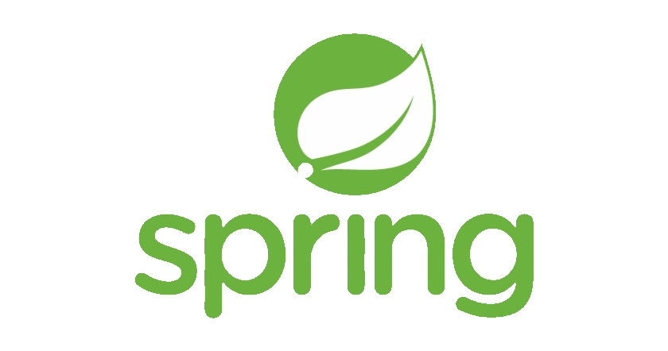
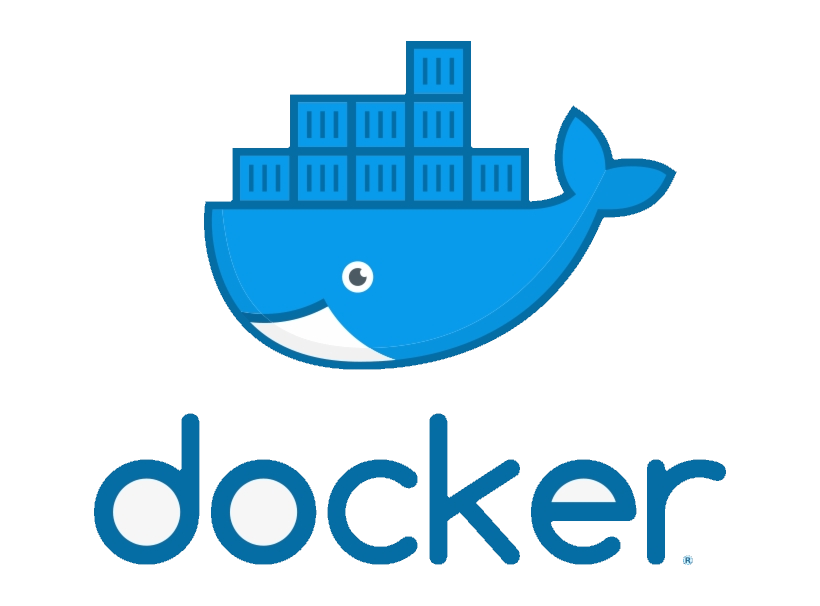

## You can follow the links below to find some of my works:
1. [University Projects](https://github.com/NutonFlash/ITMO_University)
2. Commercial Products:
   - [Telegram Bot](https://github.com/NutonFlash/Telegram_Bot)
   - [Educational Website](https://github.com/NutonFlash/Educational_Website)
## Languages and hard skills

   
   
   
   
   
   
   

